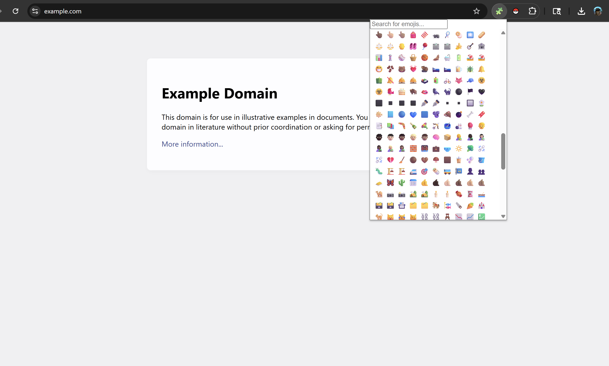

# 🧩 emojMe – A Fast, Minimal Emoji Picker Extension

**emojMe** is a lightweight Chrome extension that gives you instant access to thousands of emojis. Just click, copy, and paste – no fluff, no fuss.

---

## 🚀 Features

- 🔎 **Search** emojis by keyword (e.g., “heart”, “cat”, “moon”)
- ⚡ **Instant copy-to-clipboard** on click
- 💬 “Copied!” tooltip confirmation
- 🧠 Smart filtering using keyword metadata
- 🧱 Clean, responsive layout with lazy loading for speed
- 🎛️ Scrollable emoji grid and draggable popup window

---

## 📦 Installation

1. Clone or [Download](https://github.com/jakep84/emojme) this repository.
2. Open Chrome and navigate to: `chrome://extensions/`
3. Enable **Developer mode**
4. Click **Load unpacked**
5. Select the project folder (where `manifest.json` is)

---

## 🧠 Usage

- Click the 🧩 extension icon in your Chrome toolbar.
- Start typing in the search bar (e.g. `fire`, `smile`, `rocket`)
- Click any emoji to copy it to your clipboard.
- Paste it anywhere! 💥

---

## 📁 Project Structure

    📦 emojme/
    ├── popup.html           # UI markup
    ├── popup.js             # Logic (lazy render, search, clipboard)
    ├── emoji-list.js        # Master emoji list with keywords
    ├── popup.css            # Styling
    ├── manifest.json        # Chrome extension config
    └── icons/               # Extension icons (128x128 etc.)

---

## 💡 Future Ideas

- ✅ Keyboard navigation for accessibility
- 🌈 Emoji skin tone selector
- 🕒 Recently used tab
- 🔖 Custom emoji collections (favorites)

---

## 🤝 Contributing

Pull requests are welcome! For major changes, please open an issue first to discuss what you’d like to change or add.

---

## 📜 License

[MIT](LICENSE)

---

## 🧑‍💻 Made with 💖 by [Jake](https://github.com/jakep84)
